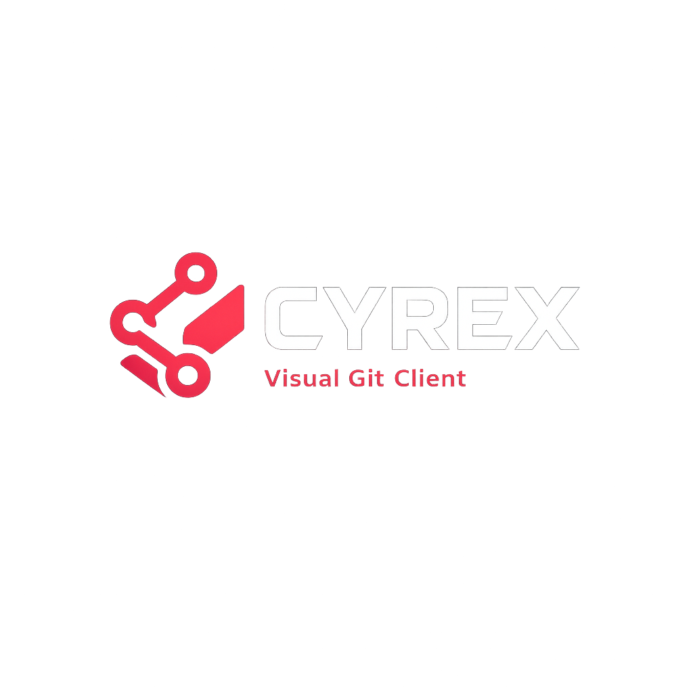

<p align="center">
  
</p>

# Cyrex

A calm, cross-platform visual Git client for Windows, Linux, and macOS. Cyrex turns everyday Git work — commit, branch, merge, rebase, stash, remotes — into a fast, readable, graphical experience without hiding what Git is actually doing.

<!-- Badges: build status, license, latest release, platforms. Wired once CI exists. -->
Status: early development (0.1.0) · License: MIT · Platforms: Windows, Linux, macOS

<!-- Hero screenshot of the commit graph goes here: docs/screenshots/graph.png -->
_Hero screenshot (commit graph) to be added._

## Highlights

- Visual commit graph with lanes, refs, and tags — the signature view, rendered from real repository state.
- Stage by file, hunk, and line; amend; signed commits where configured.
- Branch, merge, rebase (including interactive), cherry-pick, revert, stash.
- Side-by-side and inline diffs with syntax highlighting.
- Multi-repo management with quick switching.
- Calm, flat, minimal UI with a single crimson accent, light and dark themes, and 11 shipped languages.

## Install

Pre-built installers are produced per platform once the release pipeline is in place.

- Windows: NSIS installer and a portable build.
- Linux: AppImage and deb.
- macOS: dmg (built on macOS; signed/notarized).

Until the first release, see Build from source below.

## Screenshots

_Diff view, sidebar, and staging area screenshots to be added under `docs/screenshots/`._

## Feature matrix

| Feature | Status |
|---|---|
| Open / switch repositories | Done |
| Commit graph (lanes, refs, tags) | Done |
| Status (staged / unstaged / untracked / conflicts) | Done |
| Branch and tag listing | Done |
| Branch checkout / create / rename / delete | Done |
| Per-commit diff view (inline + side-by-side) | Done |
| Syntax highlighting in diffs | Done |
| Stage / unstage / discard by file | Done |
| Stage / unstage by hunk and line | Done |
| Commit staged changes | Done |
| Amend / sign commits | Done |
| Merge / cherry-pick / revert | Done |
| In-progress operation banner (continue / abort) | Done |
| Rebase | Done |
| Interactive rebase UI | Done |
| Stash save / apply / pop / drop | Done |
| Fetch / pull / push, upstream tracking | Done |
| Conflict detection and resolution UI | Done |
| Blame and per-file history | Done |
| Commit search (message / author / sha) | Done |
| Undo / reflog surface | Done |
| Embedded terminal (command runner) | Done |
| Command palette (Cmd/Ctrl+K) | Done |

## Supported languages

English, Mandarin Chinese, Hindi, Spanish, French, Arabic (RTL), Bengali, Portuguese, Russian, Urdu (RTL), and German. English and German ship complete today; the rest fall back to English until their translations land. Canonical Git nouns (commit, branch, rebase, stash) are kept in English across all locales by convention.

## Build from source

Prerequisites: Node 20 or newer, and your platform's standard build tools.

```bash
npm install
npm run dev        # launch the app in development
npm run build      # type-check and build to out/
npm run dist       # package installers for the current platform
```

### Git engine note

Cyrex is a UI over real Git. The engine layer lives only in `src/main/git/` and the renderer never touches Git directly — all access goes through typed, zod-validated, allow-listed IPC.

The engine currently runs on the system `git` binary (the CLI fallback described in the project guide). The architecture leaves a clean seam for `nodegit` (libgit2) as the primary backend; because `nodegit` is a native module, integrating it requires `npm run rebuild` (electron-rebuild) after install and after any Electron upgrade. See `src/main/git/engine.ts`.

### Cross-platform builds

Because the engine will use a native module, building every OS from one machine is not practical:

- Linux (deb + AppImage) builds natively on Linux.
- macOS (dmg) requires a real macOS machine or a macOS CI runner; signing and notarization need Apple credentials.
- Windows (NSIS + portable) is most reliable when built on Windows or a Windows CI runner.

The recommended setup is a GitHub Actions matrix (`ubuntu-latest`, `windows-latest`, `macos-latest`) that rebuilds native modules and runs electron-builder per OS.

## Contributing

This project uses Gitflow with Conventional Commits and Semantic Versioning. Branch features from `develop`, use messages like `feat(graph): ...` or `fix(engine): ...`, and open pull requests against `develop`.

## License

MIT.
